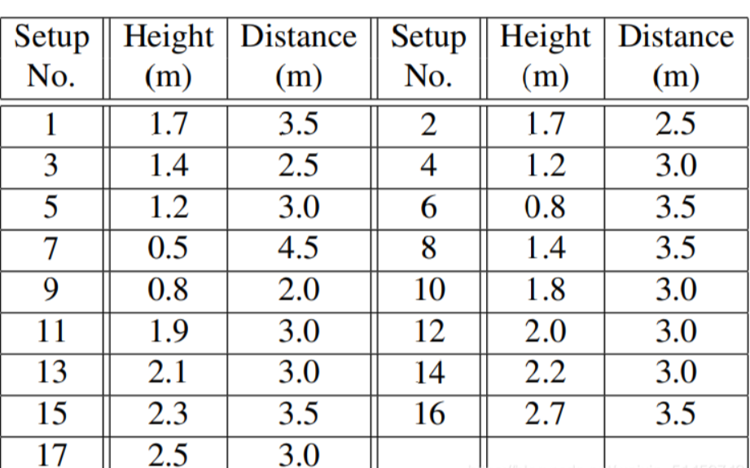
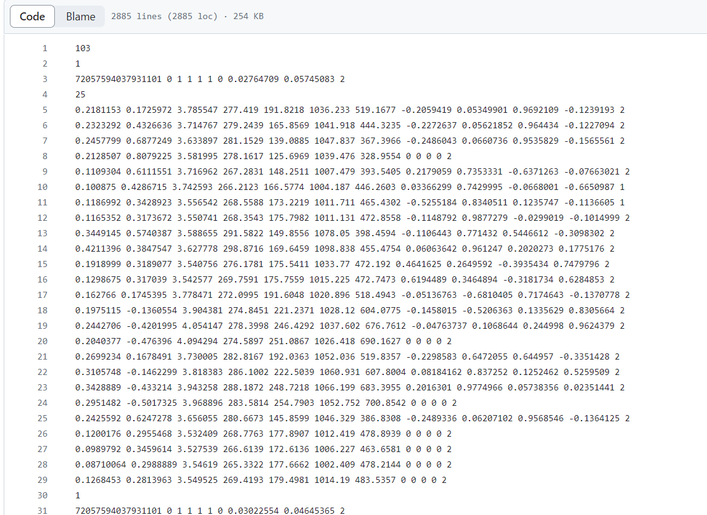

# Intro
- This dataset contains 60 types of actions, with a total of 56,880 samples. Among them, 40 classes are daily activities, 9 classes are health-related actions, and 11 classes are interactions between two individuals. These actions were performed by individuals aged from 10 to 35 years old. The dataset was collected using Microsoft Kinect v2 sensors, with data captured from three different camera angles. The collected data includes depth information, 3D skeletal information, RGB frames, and infrared sequences.

## 60 types of actions
- A1. drink water.
A2. eat meal/snack.
A3. brushing teeth.
A4. brushing hair.
A5. drop.
A6. pickup.
A7. throw.
A8. sitting down.
A9. standing up (from sitting position).
A10. clapping.
A11. reading.
A12. writing.
A13. tear up paper.
A14. wear jacket.
A15. take off jacket.
A16. wear a shoe.
A17. take off a shoe.
A18. wear on glasses.
A19. take off glasses.
A20. put on a hat/cap.
A21. take off a hat/cap.
A22. cheer up.
A23. hand waving.
A24. kicking something.
A25. reach into pocket.
A26. hopping (one foot jumping).
A27. jump up.
A28. make a phone call/answer phone.
A29. playing with phone/tablet.
A30. typing on a keyboard.
A31. pointing to something with finger.
A32. taking a selfie.
A33. check time (from watch).
A34. rub two hands together.
A35. nod head/bow.
A36. shake head.
A37. wipe face.
A38. salute.
A39. put the palms together.
A40. cross hands in front (say stop).
A41. sneeze/cough.
A42. staggering.
A43. falling.
A44. touch head (headache).
A45. touch chest (stomachache/heart pain).
A46. touch back (backache).
A47. touch neck (neckache).
A48. nausea or vomiting condition.
A49. use a fan (with hand or paper)/feeling warm.
A50. punching/slapping other person.
A51. kicking other person.
A52. pushing other person.
A53. pat on back of other person.
A54. point finger at the other person.
A55. hugging other person.
A56. giving something to other person.
A57. touch other person's pocket.
A58. handshaking.
A59. walking towards each other.
A60. walking apart from each other.

## Two different criteria
The NTU datasets uses two different division criteria when dividing the training set and the test set.

### Cross-Subject
Cross-Subject divides the training set and the test set according to the character ID. The training set has 40320 samples and the test set has 16560 samples. The character IDs are 1, 2, 4, 5, 8, 9, 13, 14, 15,16 , 17, 18, 19, 25, 27, 28, 31, 34, 35, 38, 20 people are used as the training set, and the rest are used as the test set.

### Cross-View
The training set and the test set are divided by camera. The samples collected by camera 1 are used as the test set, and cameras 2 and 3 are used as the training set. The number of samples is 18960 and 37920 respectively.
Speaking of cameras, we have to talk about the camera setting rules. The vertical heights of the three cameras are the same, and the horizontal angles are -45°, 0° and 45° respectively. Each action executor performs the same action twice. , facing the camera on the left once and facing the camera on the right once, which means that in the end, 2×3 information from different angles will be collected. Finally, set different camera heights and distances to increase the diversity of viewing angles, and assign a setting number (1-17)  

- The method I use to divide the training set and test set is based on different cameras' view.

# File naming rules and data structure
Take the S001C001P001R001A001.skeleton file as an example:  
S is followed by the setting number (1-17)  
C is followed by the camera ID (1-3)  
P is followed by the character ID (1-40)  
R is followed by the number of times the action is executed (1-2)  
A is followed by the classification of the action (1-60)  

  
- The first line is the frame number of the sample  
- Line 2 The number of people performing the action  
- There are 10 data in line 3 representing 'bodyID', 'clipedEdges', 'handLeftConfidence', 'handLeftState', 'handRightConfidence', 'handRightState', 'isResticted', 'leanX', 'leanY', 'trackingState'  
- Line 4 represents the number of joint points  
- Lines 5-29 contain information about 25 joint points. Each joint point has 12 data, representing 'x', 'y', 'z', 'depthX', 'depthY', 'colorX', 'colorY' respectively. ,'orientationW', 'orientationX', 'orientationY','orientationZ', 'trackingState'  
- The above is the information of one frame, and other frames are represented in the above way.